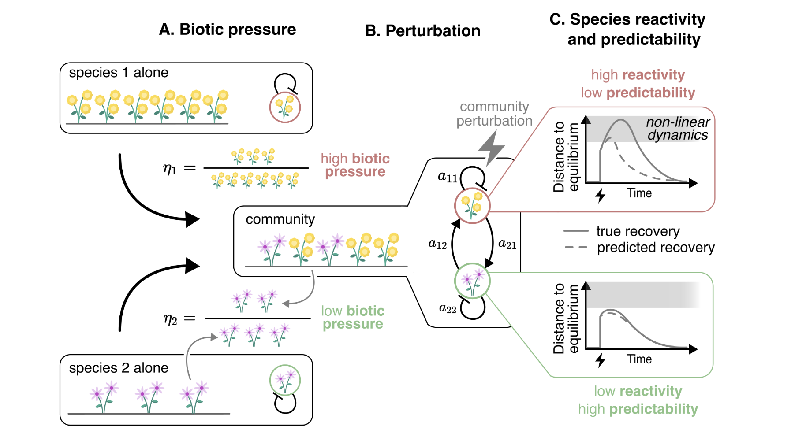

# How biotic interactions structure species’ responses to perturbations 

GitHub repository associated to the [Lajaaiti et al., 2023](change-url) article.

## Abstract

The response of communities to perturbations is usually measured at the community level which disregards
the variability of species’ responses. We therefore know very little about how this variability is structured
within communities. Here we break down the community response to the species level and show that this
decomposition provides new insights on the response of the community as a whole. In both communities
parameterized randomly or from data, we find that the more the abundance of a species is diminished by biotic
interactions, the more strongly the species reacts to perturbations and the less predictable its recovery becomes.
Returning to the community level, we find that when species diminished by biotic interactions nevertheless
remain abundant, the recovery of the whole community becomes unpredictable.



## Reproduce figures of the article

To reproduce figures of the article, first you have to clone this repository.

```bash
git clone git@github.com:ismael-lajaaiti/species-reactivity.git
```

Secondly, you can move to the `scripts/` directory and install the required package automatically with:

```bash
cd scripts # From the root of the project.
julia --project=. -e 'using Pkg; Pkg.instantiate()' # Install Julia packages.
```

> [!TIP]
> It is advised to use Julia 1.10, otherwise you may need to resolve conflicts between package versions with:
> ```bash
> julia --project=. -e 'using Pkg; Pkg.update()'
> ```

Finally, you can execute the scripts.

```bash
julia --project=scripts 01_reactivity-yield-predictability.jl
julia --project=scripts 02_selection-effect.jl
julia --project=scripts 03_data.jl
```

Figures are saved in the `scripts/figures/` directory.

> [!NOTE]
> If you are unable to reproduce the figures, you can [open an issue](https://github.com/ismael-lajaaiti/species-reactivity/issues), so we can help you.

## Structure of the code

This project is structured as Julia Package named `SpeciesReactivity`.
The package contains general functions used by the scripts of the article.
For instance, the `response` function allows simulating the response of a community to a specified perturbation.
The code of the package is stored in the `src/` directory.
The code of the package is tested in the `test/` directory.
The scripts producing the figures of the article are stored in the `scripts/` directory.
The figures produced by the scripts are stored in `scripts/figures/` directory (which is created after the first script is run).
